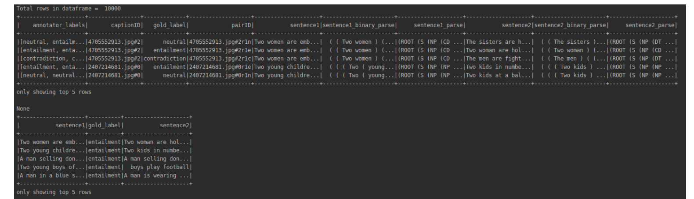
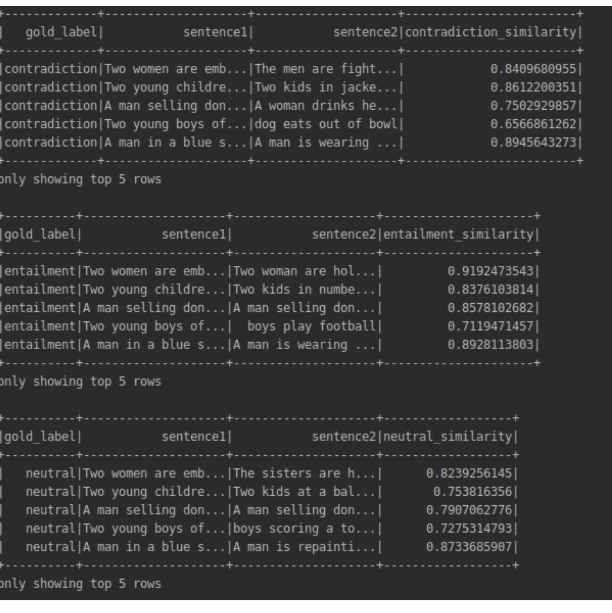

# This file contains Exploratory Data Analysis Results

SNLI corpus is hand crafted entailment - contradiction corpus that created by stanford university researchers. Raw SNLI corpus is human-labeled using 5 annotators as (Contradiction - Entailment - Neutral). The gold label is the mean of the human labels.
Standart SNLI corpus data type is JSONL and contains following features.

### SNLI Train JSONL
```
* SNLI_train.JSONL ->  is 549367 rows combined of sentence pairs (it has sentece - gold label - labels and POS tags)
* Raw json file is 487 MB of data
* File size after using BERT transformer is 6GB (reason of the huge file size is that bert used 15kb of data per token)
```

### SNLI Dev JSONL
```
* SNLI_dev.JSONL ->  is 9842 rows combined of sentence pairs (it has sentece - gold label - labels and POS tags)
* Raw json file is 9 MB of data
* File size after using BERT transformer is 120MB (reason of the huge file size is that bert used 15kb of data per token)
```
### SNLI Test JSONL
```
* SNLI_dev.JSONL ->  is 9842 rows combined of sentence pairs (it has sentece - gold label - labels and POS tags)
* Raw json file is 9 MB of data
* File size after using BERT transformer is 120MB (reason of the huge file size is that bert used 15kb of data per token)
```

SNLI dev and test data has the same row size. The raw file is fixed as 550,000 train - 10,000 Dev / Test. But some paris has no gold label and for the sake of the NN model we exclude these pairs.

## RAW data file insights



as can be seen from the image raw data has too many feautures which includes pos tags created by using stanford parser. For the simplicity we only select the features that we need.

## Processed data files

In the following image contradiction similart is calculated by using BERT transformer. reason we are excluded the vectors from the JSON file is that BERT creates huge vector that pushes file size up to 6GB. Therefore we only keep similarty result in the last column.



# Visualising the similarity results
It is hard to come to a conclusion from the raw similarity results. even though it yields good measurement of paris similarity, main goal is here to find a higher view of the data. in  the following section you will be seeing boxplots from similarity results.

### SNLI Train Similarity box plot

Following image contains the boxplot results from Train SNLI dataset 


### SNLI Dev Similarity box plot

Following image contains the boxplot results from Dev SNLI dataset 


### SNLI Test Similarity box plot

Following image contains the boxplot results from Test SNLI dataset 


As can be seen from the boxplot result it is really hard to make a conclusion from similarity results. Majority of the data is out of bond and most of the rest is clustered in to very similary range. Therefore more advanced approaches are needed. With these information we will be creating a similary network that learns from SNLI corpus and we will extend this network by combining SNLI - XNLI and other entailment datasets.
